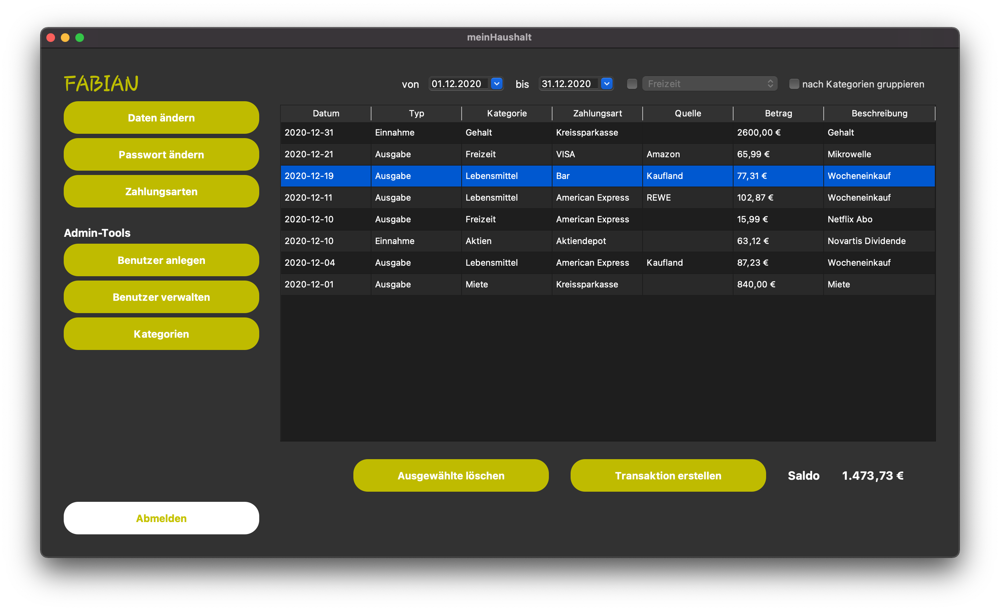
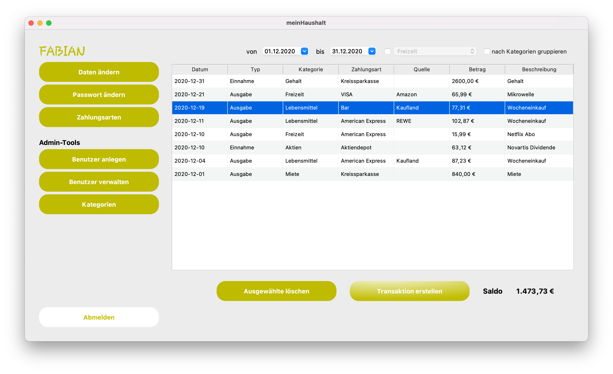
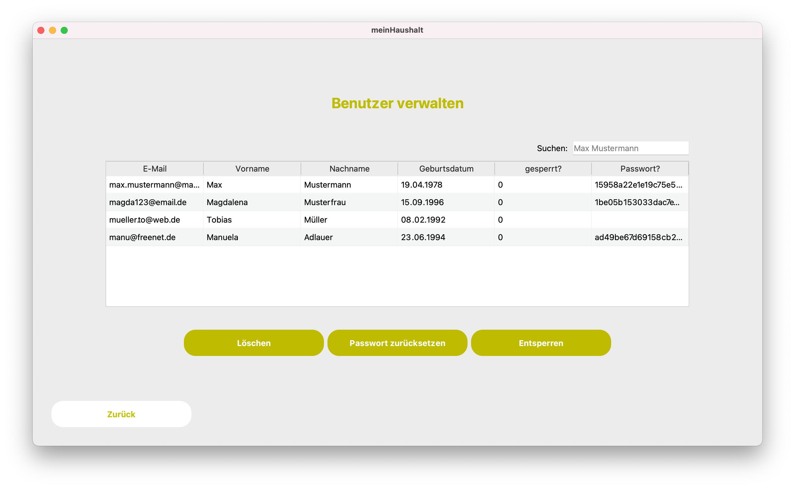
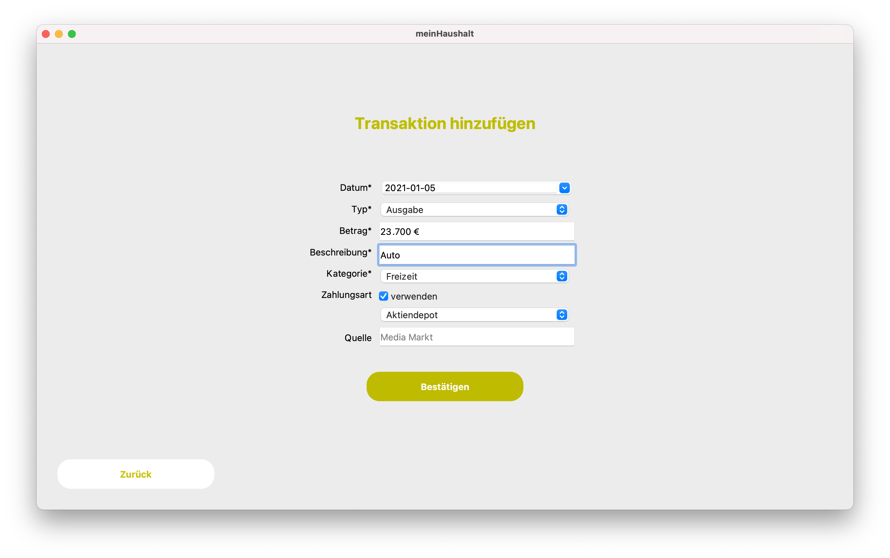

# meinHaushaltsbuch 📚

<b>meinHaushaltsbuch</b> is an Application for MacOS and Windows that helps you and your 
household members to keep track of their spendings and earnings and become more financially responsible.

This application was built as part of a lecture at Aalen University within 3 weeks.

## 🌟 Features
### Admin
* Single Admin who manages the system
* Create and delete users
* Reset password of users
* Unlock locked users
* Create and delete categories for all users to use

### Users
* Each user with their own space - protected by a own password and not visible to the Admin
* Create and delete own means of payment
* Change personal details

### Transactions
* Add, alter and delete transactions
* Transaction consisting of Date, Type (Spending/Earning), Price, Description, Category, Means of Payment and Source
* Show transactions in certain timeperiod in table 
* Sort table by date or category 
* Group table by category
* Show balance of transactions 

## 🆕 Upcoming Features
* Export transactions to Excel-File
* Search in Transaction-Table

## 🛑 Known Bugs
* Let me know if you found any bugs and I will try to fix them

## 🖼️ More Screenshots

